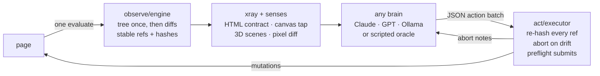
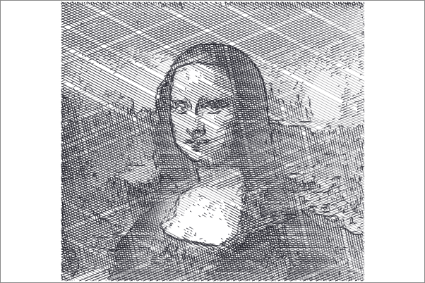
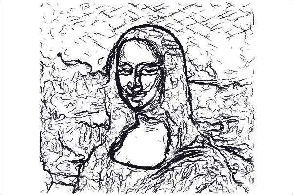
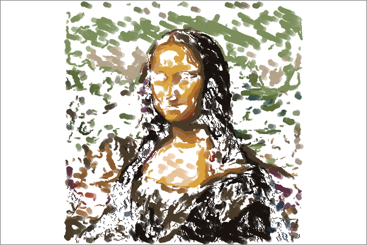
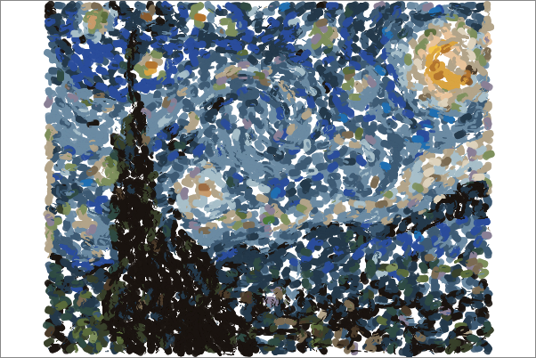
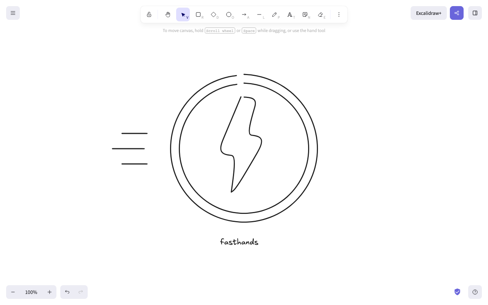
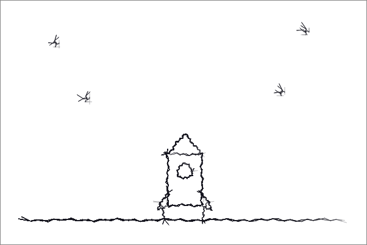

# fasthands

**Open-source, model-agnostic computer use. Same task, fewer tokens, fewer turns,
with any model as the brain, including a 4B running on your laptop.**

Computer-use agents today come in two flavors. Anthropic's reference loop sends a
screenshot every turn (about 1,366 image tokens at 1280x800) and takes one action
per turn. OpenAI's GPT-6 Astra loop is smarter: accessibility trees and code
actions, but it resends a fresh full tree every turn, it is closed, and it runs one
company's models. Its own write-up admits stale trees and state drift between
observing and acting as open failure modes.

fasthands attacks the loop, not the model. Every claim below is measured,
reproducible with zero API keys, and reported with its caveats.

## The claims, and where each one is proven

| # | Claim | Evidence | Reproduce |
|---|---|---|---|
| 1 | 91.3% fewer observation tokens than a screenshot loop, 61.2% fewer than an Astra-style full-tree loop | [Proof 1](#proof-1--the-headline-120-runs), 120 runs | `npm run bench -- --repeat 5` |
| 2 | Blind batching misclicks catastrophically under DOM drift; guarded batching never does | [Proof 2](#proof-2--the-drift-trap-0-vs-100-catastrophe), 40 trials: 0% vs 100% | `node --experimental-strip-types src/bench/drift-test.ts` |
| 3 | Diff observations stay flat while every other strategy grows with page size | [Proof 3](#proof-3--scale-where-baselines-drown), 38 tokens vs 92,732 at N=2000 | `node --experimental-strip-types src/bench/scale-test.ts` |
| 4 | Reading the HTML contract (xray) removes whole turns of error recovery | [Proof 4](#proof-4--xray-the-webs-hidden-instruction-manual), signup trap: 2 turns vs 3 to 8 | included in the bench |
| 5 | The harness carries a real 4B local model through real tasks | [Proof 5](#proof-5--live-a-4b-local-model-as-the-brain), 46% fewer live tokens, trap flips fail to pass | `--provider compat --review` |
| 6 | Canvas, WebGL and drawing are first-class: observe below the DOM, act in strokes | [Proof 6](#proof-6--below-the-dom-the-graphics-stack), the gallery below | `demos/*.ts` |

## The skeleton

Every module is small, dependency-light (Playwright is the only runtime dep), and
runs directly under Node 24 with no build step. Tests are plain scripts, no
framework.

```
fasthands/
├── src/
│   ├── types.ts          ← THE CONTRACT: every interface, frozen; start reading here
│   ├── observe/           (1,040 loc)  the eyes
│   │   └── engine.ts     ← compact interactive tree, stable refs, DIFFS, budget,
│   │                       content-hash resolve, scroll-position header
│   ├── act/               (679 loc)   the hands
│   │   └── executor.ts   ← guarded batches: every ref re-hashed before firing;
│   │                       click/fill/select/press/scroll/pointer/STROKE;
│   │                       xray preflight gate; animation-aware settle
│   ├── agent/             (1,137 loc) the loop
│   │   ├── loop.ts       ← observe → annotate → brain → guarded batch → diff;
│   │   │                   abort notes, done-review gate, senses, council hook
│   │   ├── council.ts    ← k parallel proposals, scored by ref-resolvability
│   │   └── reflex.ts     ← replay cache for repeat tasks, behind the same guards
│   ├── providers/         (286 loc)   the brains (plain fetch, no SDKs)
│   │   ├── anthropic.ts  openai.ts  compat.ts (Ollama/Groq/Together/vLLM)
│   │   └── shared.ts     ← depth-scan JSON extraction, <think> stripping
│   ├── xray/              (614 loc)   the instrument panel
│   │   └── xray.ts       ← HTML-contract annotations, consequence prediction,
│   │                       checkValidity preflight
│   ├── canvas/            (1,854 loc) below the DOM
│   │   ├── tap.ts        ← canvas 2D command-stream tap (pre-rasterization)
│   │   ├── pixels.ts     ← raster DIFF fallback (changed-region, not screenshots)
│   │   ├── gl.ts         ← Three.js scene introspection + camera projection
│   │   └── artist.ts     ← image → human-like stroke plans; palette painting
│   └── bench/             (1,674 loc) the proofs
│       ├── run.ts        ← 4 loop styles × 6 tasks, repeats, live providers
│       ├── drift-test.ts  scale-test.ts  oracle.ts  tasks.ts  fixtures-server.ts
├── fixtures/              (12 files)  deterministic benchmark sites, incl. traps
├── demos/                 the gallery: paint.ts davinci.ts draw.ts paintbrush.ts
│                          icon.ts comic.ts designer.ts + rendered outputs
└── docs/                  competitive research, rasterization thesis
```

The architecture in one picture:



## Proof 1 · the headline, 120 runs

Six tasks (form, product search, checkout wizard, settings toggles, infinite
scroll, validation-trap signup) × four loop styles × five repetitions, identical
deterministic oracle policy, success judged by the DOM, never by the agent's
claim. 120/120 verified passes, near-zero variance (only the infinite-scroll task
moves, ±445 tokens from scroll timing).

| style | models | turns | observation tokens | success |
|---|---|---:|---:|---|
| screenshot | Anthropic-style loop: image/turn, 1 action/turn | 210 | 286,860 | 30/30 |
| fulltree | Astra-style loop: full a11y tree/turn, batched | 130 | 63,984 | 30/30 |
| **fasthands** | diffs + guarded batching | 127 | **24,817** | 30/30 |
| **fasthands + xray** | + HTML-contract annotations | **125** | 29,250 | 30/30 |

**91.3% fewer tokens and 39.5% fewer turns than the screenshot loop; 61.2% fewer
tokens than the Astra-style loop.** Screenshot image tokens use Anthropic's own
published (w·h)/750 formula.

Honest trade-off, reported as measured: xray annotations are not free. On tasks
without forms they cost extra (29,250 vs 24,817 across the suite); they pay for
themselves where hidden contracts exist. Turn xray on when forms are in play.

## Proof 2 · the drift trap: 0% vs 100% catastrophe

The failure mode Astra's authors themselves admit: state drift between observing
and acting. A page swaps an "Archive message 3" button into "Delete all messages"
800ms after load, in place, the way real lists reorder and ads inject. The agent
observed before the swap and acts after it.

| arm | trials | catastrophes | safe aborts | recovered |
|---|---:|---:|---:|---:|
| unguarded batch (fires on stale refs) | 20 | **20 · 100%** | 0 | 0 |
| fasthands guarded batch | 20 | **0 · 0%** | 20 | **20 · 100%** |

The guard is a content hash re-checked at click time: the mutated node no longer
matches what the model saw, the batch aborts with `drift: ref e12 no longer
matches`, and the next observation finds the real button. Forty trials, zero
nondeterminism.

## Proof 3 · scale: where baselines drown

Per-observation cost on a parametric page with N distractor elements, one small
state change, measured on identical DOM (chars/4 for all text strategies, so the
ratios are apples-to-apples):

| N elements | raw HTML dump | screenshot | full a11y tree | **fasthands diff** |
|---:|---:|---:|---:|---:|
| 50 | 5,333 | 1,366 | 2,197 | **38** |
| 200 | 15,642 | 1,366 | 8,962 | **38** |
| 500 | 36,533 | 1,366 | 22,791 | **38** |
| 1,000 | 71,513 | 1,366 | 46,000 | **39** |
| 2,000 | 141,910 | 1,366 | 92,732 | **39** |

The full tree grows ~42x across this range; the diff after a state change stays
flat. The screenshot is flat too, but flat because it is blind: viewport-only, it
never sees below the fold. Caveat, stated plainly: under a tight 2,000-token
budget, viewport-first truncation flattens in-loop cost for both tree styles (the
in-loop diff win measures ~27% and does not grow with N on this fixture). The
dramatic gap above is per-observation, uncapped.

## Proof 4 · xray: the web's hidden instruction manual

Since HTML5, every page has shipped a machine-readable contract (`required`,
`pattern`, `min`/`max`, form membership) and a native validation engine
(`checkValidity()`) that knows a submit will fail before you submit. Every agent
framework ignores it and learns form errors the human way: submit, read the red
text, retry. One model round-trip per mistake, fifteen years after the API
shipped. fasthands reads the contract into the observation:

```
xray:
e5 · required, email format
e7 · (hidden rule) required, 5-15 chars, min length 5
e9 · (hidden rule) required, 8+ chars incl. a digit
e13 · → submits form (BLOCKED: 5 invalid: e5 required, ...)
```

The signup benchmark task is a trap: username and password rules exist only in
attributes, invisible until a failed submit.

| loop | turns | obs tokens | what happened |
|---|---:|---:|---|
| screenshot | 8 | 10,928 | fails a submit, recovers one action at a time |
| fulltree / fasthands | 3 | 388 | fails a submit, reads errors, retries |
| **fasthands + xray** | **2** | **229** | reads the rules up front, never wastes the submit |

The executor also refuses to click a submit the browser says will fail, returning
the exact violations, so even a model that ignores the annotations pays a replan,
not a wasted submit-observe-retry loop.

## Proof 5 · live: a 4B local model as the brain

Everything above isolates the loop with a deterministic policy. These runs are
live: CyberSecQwen-4B, a security-tuned Qwen3 on Ollama (not an agent model),
temperature 0, done-review gate on. Same six tasks, DOM-verified.

| style | success | live obs tokens |
|---|---|---:|
| fulltree (Astra-style) | 2/6 | 6,567 |
| **fasthands** | 3/6 | **3,548 · −46%** |
| **fasthands + xray** | 3/6 | 6,221 |

The clean result: **the signup trap fails without xray and passes with it,
reproducibly.** Same model, same prompt; the only change is the harness reading
the HTML contract into the observation.

Every booster in the loop was built from a real failure in this model's
transcripts, fixed mechanically, and re-measured:

| observed failure | shipped fix |
|---|---|
| rolled dice on every batch (Ollama defaults to temp 0.8) | providers send `temperature: 0`: argmax policy for agents |
| emitted valid JSON, then hallucinated fake transcript after it | depth-scan parser takes the first complete array; `<think>` blocks stripped |
| never scrolled: nothing said more page existed | the scrollbar in words: `scroll: viewing 0-720 of 1880px, 62% below` in every header |
| scrolled and clicked pre-scroll refs in the same batch | prompt rule: a scroll ends the batch |
| clicked "Order #4670" and certified it as "#4711" | done-review gate (`--review`): the first done bounces back against a fresh observation |
| used `select` on a checkbox, then surrendered with done | prompt rules: toggles are clicks; failure is never a reason for done |

Honest boundaries, measured: council mode (`--council 3` with
`FH_TEMPERATURE=0.7`) helps exploration-bound tasks and hurts precision-bound
ones, so it is opt-in. The deep-scroll exploration task stays failed at 4B: the
harness slashes a small model's costs and catches its lies; it does not plan for
it. And an 8B reasoning model proved impractical as an agent brain (minutes of
chain-of-thought per turn); fast-and-small beats slow-and-clever in this loop.

```bash
FH_SYSTEM_SUFFIX="/no_think" npm run bench -- --provider compat \
  --model <your-ollama-model> --base-url http://localhost:11434/v1 --review
```

## Proof 6 · below the DOM: the graphics stack

Rasterization is a one-way, information-destroying function, and every agent
reads the wrong side of it. A canvas chart exists as
`ctx.fillText("Q3 $518k", 312, 40)`, exact and token-cheap, before it exists as
300k pixels that vision models OCR back with errors. fasthands taps the command
stream before rasterization destroys it, diffs raw pixels when there is no
stream, and reads WebGL scene graphs with camera projection so a guarded pointer
can click a named 3D object with zero vision (51 tokens to observe a Three.js
scene; the projected coordinate raycasts to the right mesh). Actions grew
`pointer` and `stroke` (drift-guarded, bounds-checked) to match.

Then we made it draw. Every mark below went through the guarded executor as real
pointer gestures on an unmodified web app; color changes are clicks on the app's
own palette buttons; verification is pixel-diff, never vision.

| | |
|---|---|
|  | **Mona Lisa, engraved.** 4,601 one-pixel strokes, tone from luminance-driven cross-hatch of the real painting. 100% stroke success. |
|  | **Mona Lisa, sketched like a hand.** 2,400 curved strokes traced along the painting's own gradient field, contours first, then tone. |
|  | **In color, through the app's UI.** 3,026 strokes across 52 palette layers; the agent clicked swatch and brush buttons 55 times. |
|  | **Starry Night.** The flow-field tracer follows van Gogh's own brush directions; primed canvas, 78% coverage. |
|  | **The plotter rule.** Brush-drawn on excalidraw.com: parametric circles, exact bolt polygon, zero artificial jitter. Excalidraw's pen supplies the human character. |
|  | **Scribbly on purpose.** 8-frame stop-motion comic: seeded sketch passes give boiling lines; frames cleared via the app's own button. |

Nobody else publishes anything comparable: the most viral public attempt at
agent drawing had GPT-5.4 produce an "awful" first sketch in MS Paint, give up,
and paste a screenshot from Bing instead. Per-turn vision loops would pay 3,000+
model turns for the engraving; fasthands invoked the planner once.

## Where this sits against other frameworks

Their numbers from their own publications; we did not run their stacks. What none
of them do is diff observations: every one resends full state, every turn.

| framework | observes | their own speed claim | diffs | drift guards | reads HTML contract | draws |
|---|---|---|---|---|---|---|
| Stagehand v3 | CDP hybrid | 44% faster than own v2 | no | self-healing selectors | no | no |
| browser-use | DOM list | batching: 74% fewer calls | no | no | no | no drag primitive |
| Skyvern | vision | 10-100x cached reruns | no | no | no | no |
| Anthropic ref loop | screenshots | prompt caching, pruning | no | no | no | 1 vision turn per gesture |
| Astra (closed) | full a11y tree | "smarter → fewer turns" | no | admits drift as open | no | unpublished |
| **fasthands** | tree → diffs | measured above | **yes** | **hash-checked, 0/20** | **xray** | **stroke plans, guarded** |

## Quick start

```bash
git clone https://github.com/anzal1/fasthands && cd fasthands
npm install && npx playwright install chromium

npm run bench -- --repeat 5                               # keyless 120-run headline
node --experimental-strip-types src/bench/drift-test.ts   # 0% vs 100%
node --experimental-strip-types src/bench/scale-test.ts   # scaling curves
node --experimental-strip-types demos/paintbrush.ts <image-url>   # paint anything
```

As a library:

```ts
import { chromium } from "playwright";
import { createObservationEngine } from "./src/observe/engine.ts";
import { createExecutor } from "./src/act/executor.ts";
import { runAgent } from "./src/agent/loop.ts";
import { createXray } from "./src/xray/xray.ts";
import { createCompatProvider } from "./src/providers/compat.ts";

const page = await (await chromium.launch()).newPage();
await page.goto("https://example.com");
const engine = createObservationEngine(page);
const xray = createXray(page);
const result = await runAgent({
  page, engine, xray,
  executor: createExecutor(page, engine, xray),
  brain: createCompatProvider("llama3.1", "http://localhost:11434/v1"),
  task: { id: "demo", description: "Find the pricing page and report the cheapest plan." },
  config: { maxTurns: 15, observationBudget: 2000, batching: true, diffing: true, reviewDone: true },
});
```

## Methodology and limitations (read before citing)

- **The oracle is not a model.** Headline numbers use a deterministic scripted
  policy so every loop style gets identical competence and anyone can reproduce
  them keyless. They measure loop cost, not model intelligence. Live mode exists
  and its results are reported separately, boundaries included.
- **Fixtures are synthetic and local**, deterministic by design so the benchmark
  cannot flake its way to a good number. No claim is made about
  WebVoyager/OSWorld-style success rates against other frameworks.
- **The screenshot baseline models the loop shape** (one action per turn,
  (w·h)/750 image tokens per turn), not Anthropic's production harness, which
  adds prompt caching and history pruning.
- **Token unit:** chars/4 for every text strategy identically; image tokens use
  Anthropic's published formula. Ratios are the claim, not absolute counts.
- **Success is DOM-verified.** An agent that fabricates "done" scores as failure.
- **Competitor figures** are cited from their own publications
  ([docs/competitive-research.md](docs/competitive-research.md)), not reproduced.

## The ideas, in one list

Things that were hiding in plain sight, now in the loop:

1. HTML is a self-describing API (`required`, `pattern`, `checkValidity()`); read
   it instead of failing submits.
2. Pages know their own scroll extent; say it in words and small models start
   scrolling.
3. A canvas is a command stream before it is pixels; tap it before rasterization
   destroys the text.
4. A WebGL scene is a named object graph with a camera; project it and click 3D
   with zero vision.
5. `document.getAnimations()` announces when motion settles; stop sleeping fixed
   milliseconds.
6. Diff everything: the DOM tree, and the raster when there is no tree.
7. Style is a synthesized parameter: exact geometry from the harness, human
   character from the medium, scribble from seeded noise (which gives stop-motion
   boiling lines for free).

## Roadmap

- Prompt-cache breakpoints in providers (static prefix + stable tree)
- CDP-direct driver behind the same ObservationEngine interface
- Skyvern-style action replay at 10-100x, behind the drift guards (reflex.ts is
  the seed)
- Whiteboard/chart/3D tasks as first-class benchmark rows
- Babylon/Pixi scene introspection; occlusion-aware 3D projection
- CI that re-derives every number in this README on every PR

MIT. Built in a day by a team of Claude agents (cheap models did the grunt work,
the expensive ones wrote the engine), then hardened against real transcripts of a
4B model failing. Every number above regenerates from source.
